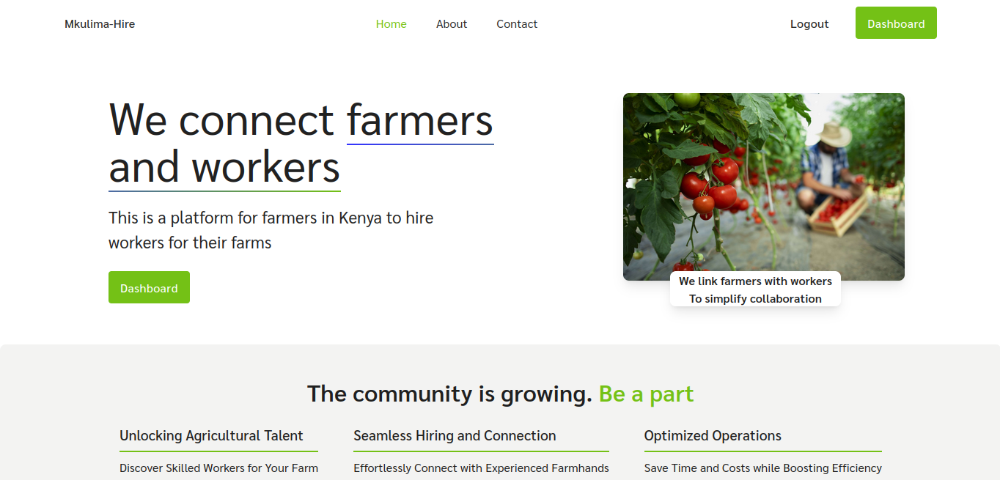

# Mkulima Hire


## Introduction

Welcome to our project! This repository contains the code for Mkulima Hire. This project aims to revolutionize agriculture in Kenya by connnecting farmers and workers through a user-friendly web platform, fostering growth, and sustainability. You can access the deployed site [here](<https://mkulimahire.vercel.app/>).

For more details about the project, its development journey, and insights, check out our [Final Project Blog Article](<https://www.linkedin.com/pulse/mkulima-hire-blog-boniface-mbogho?trackingId=P%2Ft8duVBS1u9RugYqQuPCw%3D%3D&lipi=urn%3Ali%3Apage%3Ad_flagship3_profile_view_base_recent_activity_content_view%3BqFGIrEymQcWRk6EL3f6KPw%3D%3D>). 

**Authors**:
- [Boniface Mbogho](<https://linkedin.com/in/boniface-mbogho-66242a243>)
- [Segun Lawal](<https://www.linkedin.com/in/olusegun-lawal-3b6488242/>)

## Installation

To run this project locally, follow these steps:

1. Clone this repository:
   ```bash
   git clone https://github.com/CABON-TECH/Mkulima-Hire.git
   ```

2. Navigate to the project directory:
   ```bash
   cd your-repository
   ```

3. Install dependencies:
   ```bash
   npm install
   ```

## Usage

To use this project, follow these steps:

1. Clone this repository:
   ```bash
   git clone https://github.com/CABON-TECH/Mkulima-Hire.git
   ```

2. Navigate to the project directory:
   ```bash
   cd Mkulima-Hire
   ```

3. Install dependencies:
   ```bash
   npm install
   ```

4. Run the application:
   ```bash
   npm run dev
   ```


## Contributing

We welcome contributions from the community! If you wish to contribute to this project, please follow the guidelines in our [Contribution Guidelines](CONTRIBUTING.md).


## Licensing

This project is licensed under the MIT License - see the [LICENSE](LICENSE) file for details.


**Screenshot**:
